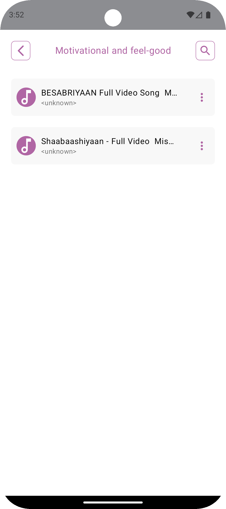

# 🎵 SongPly – Offline Music Player App

**SongPly** is an Android offline music player built using **Jetpack Compose** and **Kotlin**, designed to provide a smooth and modern user experience for playing locally stored audio files. Users can browse songs already downloaded on their device, play them within the app, and organize them into custom playlists.

---

## 🚀 Features

- 🎧 **Play Offline Songs**  
  Automatically detects and displays audio files stored on the user's device.

- 📁 **Create & Manage Playlists**  
  Users can create custom playlists and add/remove songs.

- 💡 **Modern UI with Jetpack Compose**  
  Clean, reactive, and smooth UI powered by the latest Android UI toolkit.

- 🔍 **Search & Filter**  
  Easily find your favorite tracks.

---

## 🛠️ Tech Stack

| Technology      | Description |
|-----------------|-------------|
| **Kotlin** | Primary programming language |
| **Jetpack Compose** | UI Toolkit for building native UI |
| **Room Database** | For storing and managing playlists |
| **Hilt** | Dependency Injection framework |
| **MVVM** | Clean architecture with separation of concerns |
| **ExoPlayer** | For audio playback |

---

## 📸 Screenshots

  

  
  

  
  

